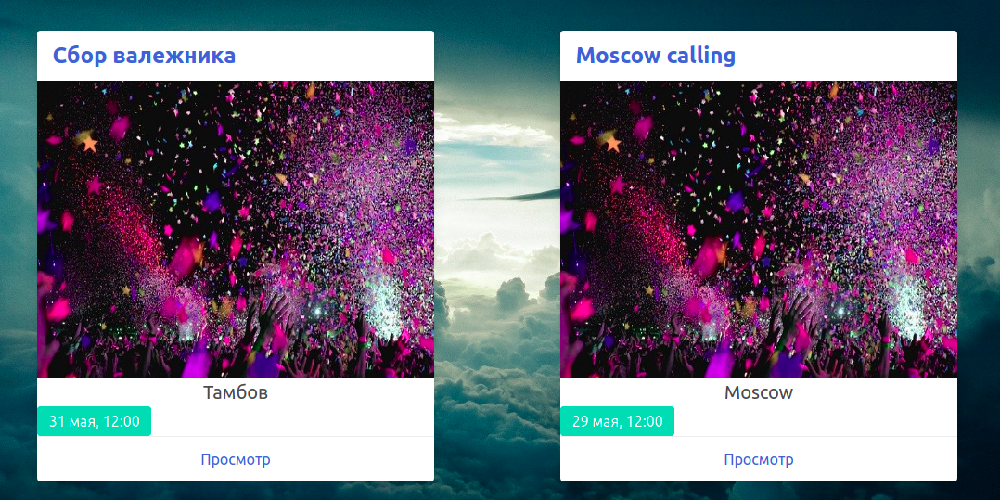

# Событийка
Приложение с личным кабинетом для каждого пользователя. Помогает создать событие, собрать воедино, в одном месте всех будущих посетителей, обсуждать мероприятие, секретить его, если необходимо, участники могут делиться фотками с события.



## Что под капотом
1. Наш любимый стремительный `Rails 6.1`
2. Аутентификация с помощью `Devise`, через соцсети - группа гемов `omniauth`
3. Авторизация реализована через логику `Pundit`
4. Работа с файлами в приложении с ипользованием `AWS S3 Amason, Active Storage`
5. Аккуратный фронтенд благодаря `slim` шаблонизатору и `CSS framework Bulma`
6. Работа с БД - `ActiveRecord` и `PostgreSQL`
7. Элементарная безопасность паролей и секретов с помощью env-окружения и `Figaro`
8. Отправка писем и полезных уведомлений  помощью `mailjet`
9. Фоновые задачи помогает реализовать - `resque`
10. Удобный и быстрый деплой с помощью `Capistrano`
11. Отсутствие assets, всю работу выполняет `webpack`
12. Проверка `rubocop-rails`
13. Локализация сделана `rails-I18n`
14. Подключены Яндекс-карты, для наглядного отображения места события
15. Подключены `flatpickr`, `lightbox`

## Как установить на локальной машине
Для старта необходим Ruby ~> 2.7.2 и bundler, node, yarn

Скачать или склонировать репозиторий, из папки проекта набрать:
```
$ bundle install
$ yarn install
$ cp config/database.yml.example config/database.yml
```

Затем создаем файлик application.yml, где прописываем все требуемые для работы переменные окружения.
___

+ PASSWORD - от БД
+ ACCESS_KEY_ID и SECRET_ACCESS_KEY - для работы с S3 Amazon
+ API_MAP - яндекс карты
+ MAILJET_API_KEY и MAILJET_SECRET_KEY - для отправки почты с сендером Mailjet, либо поменять конфигурация под себя
+ MY_MAIL - ваша почта

Создаем базу и прогоняем миграции
```
$ rails db:create
$ rails db:migrate

```
Запуск для доступа по localhost:3000

`$ rails s`

### ToDo
+ Прикрутить админку
